# 트러블 슈터

<p align="center"></p>

### 개인 에러 관리 + 공유 웹 서비스

📌 프로젝트 기간 : 2023. 09 ~ 2023.12 (진행 중)<br />
📌 프로젝트 진행자 : [김승섭](https://github.com/sub9707) <br />
📌 요약 <br />
개발을 진행하면서 발생한 에러, 오류 등을 스스로 기록하고 관리하고, 이용자 간 공유를 통해 여러 에러를 다른 사용자들과 해결하거나 도움을 주고받는 웹 서비스.

**📌 기술적 목표**

- redux를 활용한 여러 전역 state 관리(modal, theme, user 정보 등)
- React 앱 최적화 방안 적용하기 (Lazy Import, use-hook-form 등)
- JWT 활용한 보안 방안 적용 (cookie와 redux store에 access/refresh token 저장)
- node js를 활용한 서버 개발과 API 구성 (풀스택 역량 강화)
- Styled-Component를 활용한 스타일링 구현
- BootStrap을 포함, 순수 CSS를 활용해 반응형 디자인 구현

  <br />
  <br />

# 시작하기

### 요구사항

빌드와 실행에 필요한 요구사항입니다.

- [Node.js v18.17.1](https://nodejs.org/en)
- [Npm 10.1.0](https://www.npmjs.com/)
- [MariaDB 10.5](https://mariadb.org/)

## Client [React.ts]

```
npm i
npm run dev
npm run build
```

## Server [Node.js]

```
npm i
npm start
```

<br/>
<br/>

# 배포 정보

<div style="display: flex; justify-content: center;" align="center">

| 구분       | 주소                                                              |
| ---------- | ----------------------------------------------------------------- |
| 웹서비스   | https://comments-cloud.vercel.app/                                |
| 프론트엔드 | https://comments-cloud-r2er1d4at-sub9707.vercel.app/              |
| 백엔드     | https://port-0-trouble-shooter-71t02clq3dokrn.sel4.cloudtype.app/ |

</div>

### 배포 방식

<div style="display: flex; justify-content: center;" align="center">

| 구분                   | 명칭                                   |
| ---------------------- | -------------------------------------- |
| 프론트엔드             | [Vercel](https://vercel.com/)          |
| 백엔드 - Database 배포 | [CloudType](https://app.cloudtype.io/) |

</div>

<br/>
<br/>

# 기술 스택

## Frontend

<div style="display: flex; justify-content: center;" align="center">


</div>

## Backend

<div style="display: flex; justify-content: center;" align="center">


</div>

<br/>
<br/>
<br/>

# 화면구성

| 로그인 & 회원가입                                       | 메인페이지                                             |
| ------------------------------------------------------- | ------------------------------------------------------ |
| 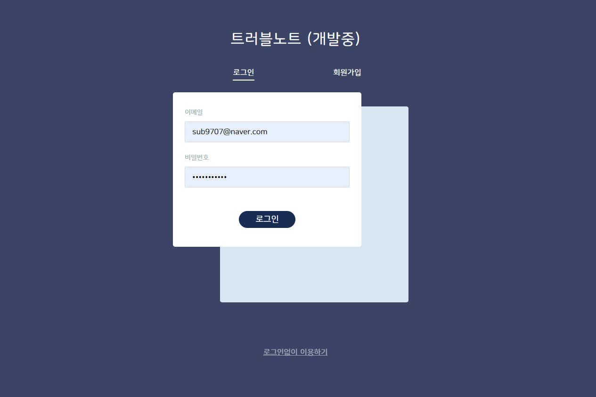 | 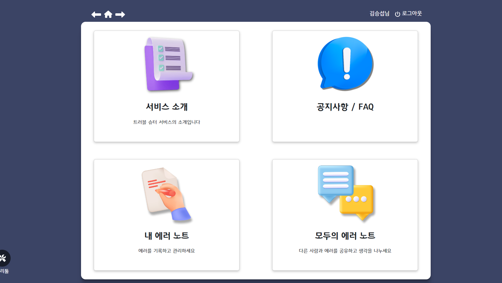 |

| 서비스 소개                                               | 공지사항                                                 |
| --------------------------------------------------------- | -------------------------------------------------------- |
| 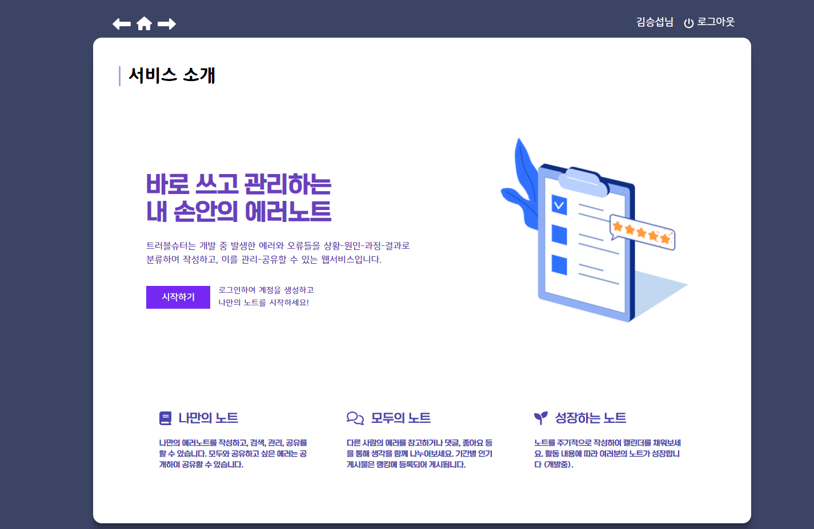 | 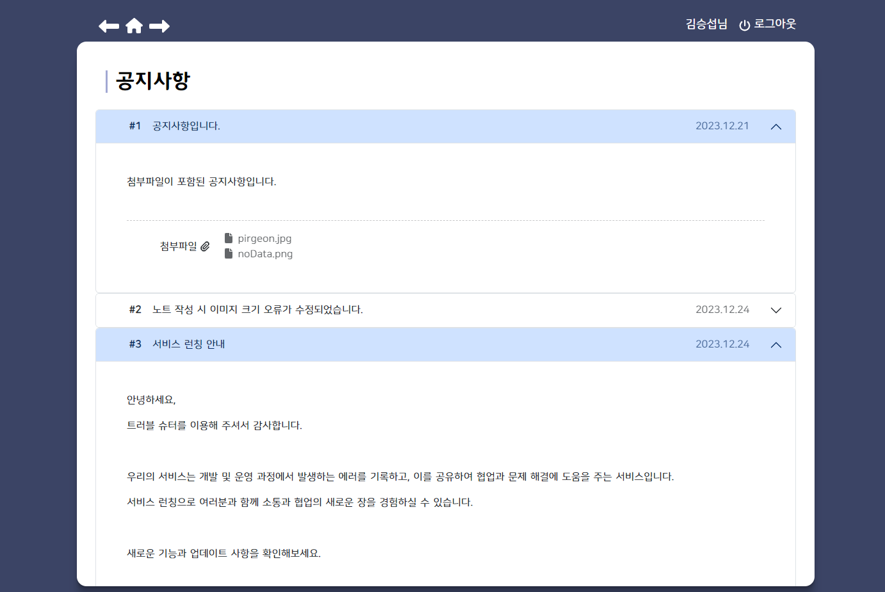 |

| 나의 에러노트                                             | 모두의 에러노트                                             |
| --------------------------------------------------------- | ----------------------------------------------------------- |
| 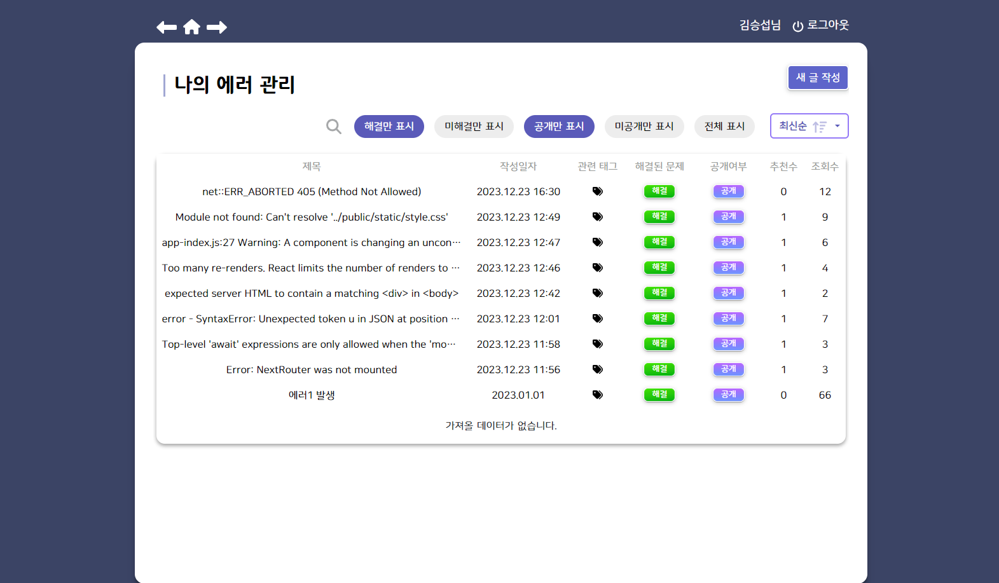 | 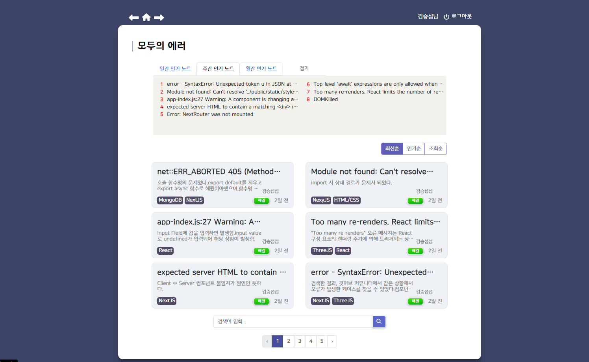 |

| 에러 상세                                                   | 개인 프로필                                               |
| ----------------------------------------------------------- | --------------------------------------------------------- |
| 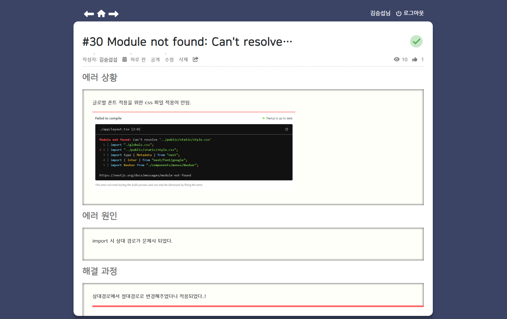 | 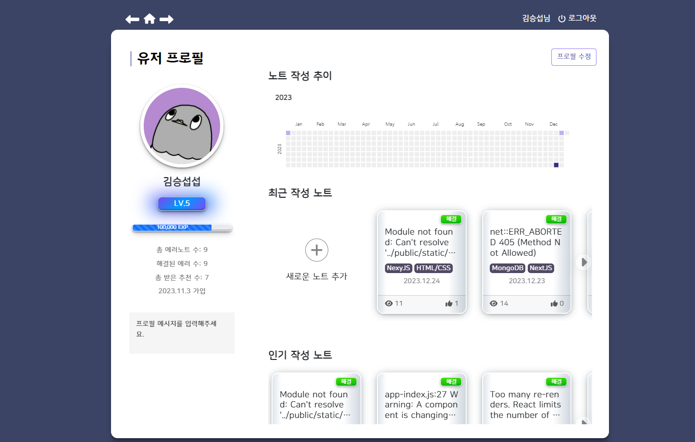 |

| 관리자 메인                                                  | 관리자 유저관리                                             |
| ------------------------------------------------------------ | ----------------------------------------------------------- |
| 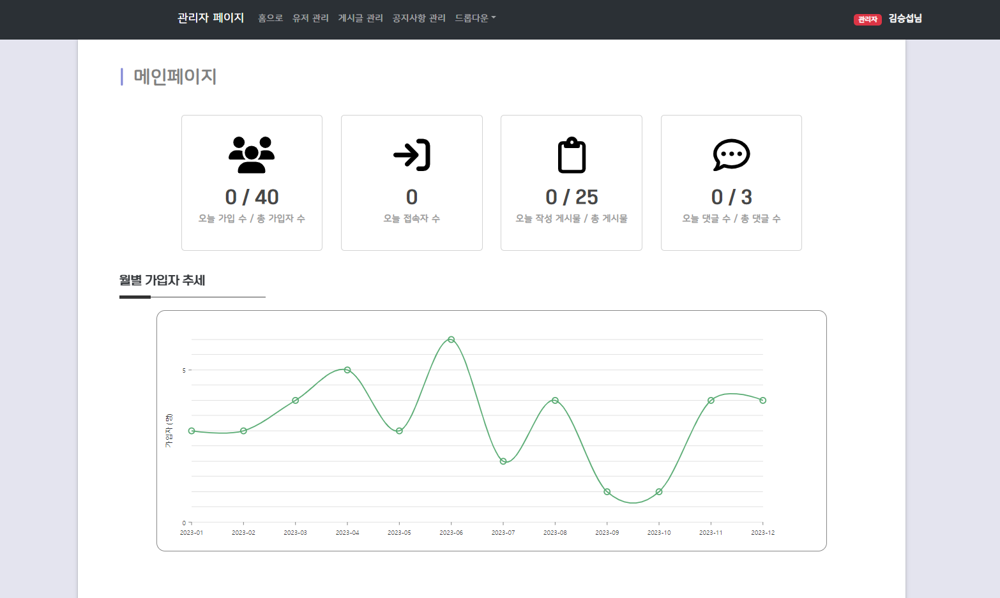 | 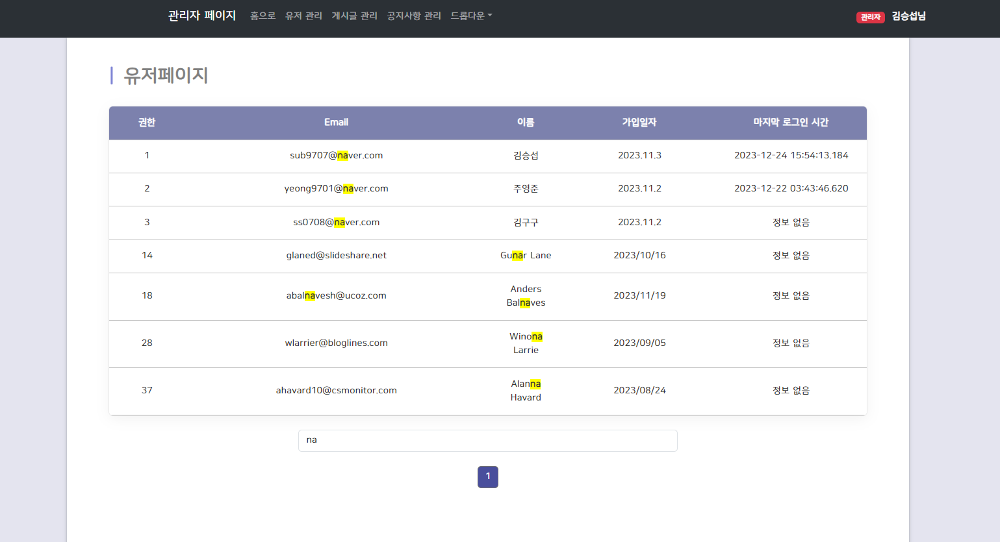 |

| 관리자 게시판 관리                                           | 관리자 공지관리                                               |
| ------------------------------------------------------------ | ------------------------------------------------------------- |
| 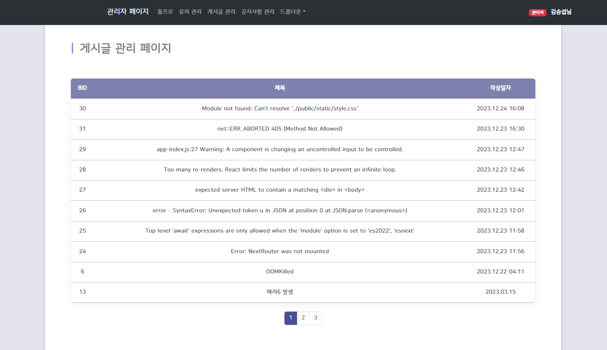 | 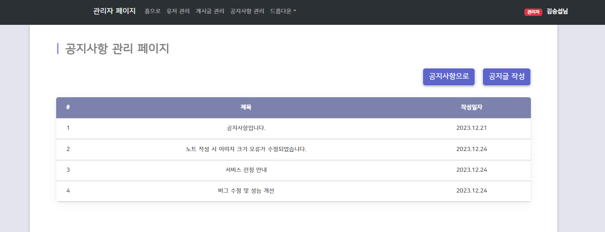 |

<br/>

# 주요 기능
